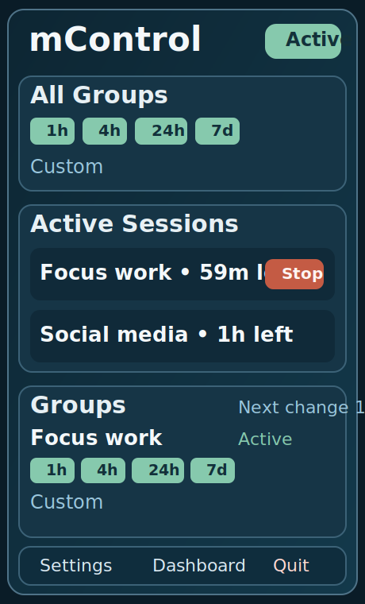

# mControl

`mControl` is a native macOS menubar blocker inspired by [SelfControl](https://selfcontrolapp.com/).

It focuses on the same core behavior (time-bound blocking) and extends it with group-based scheduling and severity modes.

## App Preview


Dashboard layout:


Menubar popover layout:



## What it does

- Runs as a macOS menubar app using `MenuBarExtra`.
- Uses a compact menubar shield indicator (outline when idle, green-filled when any session is active).
- Menubar popover uses the same dark visual palette as the dashboard.
- Menubar popover has an `All Groups` section with quick start (`1h`/`4h`/`24h`/`7d`) and custom duration for starting every group at once.
- Group rows in menubar are start-focused (quick start + custom). Active session stopping is handled in `Active Sessions`.
- Settings include `Launch at Login`, `Ask before Quit from menubar`, `Default custom duration`, and background PF daemon install/update.
- Lets you define multiple block groups, each with its own domain list.
- Supports multiple intervals per group (overlapping across groups is allowed).
- Shows live status in the menubar popover and opens a full Dashboard window for editing/scheduling.
- Supports severity per group:
  - `strict`: interval cannot be stopped early.
  - `flexible`: interval can be stopped early.
- Persists app state in JSON at:
  `~/Library/Application Support/mControl/state.json`.

## First-Time Setup

1. Install app from DMG and run `mControl` from `Applications`.
2. Open menubar popover and click `Dashboard`.
3. Create your first group in Dashboard using `New Group`.
4. Add domains (one per line), select severity (`strict` or `flexible`), click `Save`.
5. Start a session from:
   - Dashboard group card (`1h`, `4h`, `24h`, `7d`, or `Custom`).
   - Menubar popover (`All Groups` or per-group quick buttons).
6. Optional but recommended: in `Settings`, install `Background PF Refresh` daemon to avoid hourly password prompts for PF refresh.

## Where To Create Groups

Groups are created and edited in Dashboard:

- Open menubar popover.
- Click `Dashboard`.
- Use `New Group`.
- Configure:
  - `Name`
  - `Domains` (one per line; full URLs are normalized to hostnames)
  - `Severity`:
    - `strict`: cannot stop early
    - `flexible`: can stop early

## Where To Start / Stop Sessions

- Start:
  - Dashboard group cards (`1h`, `4h`, `24h`, `7d`, `Custom`)
  - Menubar popover (`All Groups` quick start and per-group quick start/custom)
- Stop:
  - Menubar `Active Sessions` section (`Stop` / `Stop All`)
  - Dashboard active session cards
  - Strict sessions are intentionally not stoppable early.

## How blocking works

mControl uses two layers in one synchronized apply operation:

1. `/etc/hosts` managed block section.
2. macOS Packet Filter (`pf`) anchor rules (`com.apple/mcontrol`) to block resolved IPs.

This mirrors SelfControl-style hardening better than hosts-only blocking and helps when browsers use Secure DNS / DoH.

mControl still manages a marker-based section inside `/etc/hosts`:

- Begin marker: `# >>> mControl BEGIN`
- End marker: `# <<< mControl END`

When active domains change, the app rewrites only that managed hosts section and also refreshes the PF anchor.
PF IP resolution samples multiple DNS answers per domain, queries public DoH resolvers, and follows CNAME chain targets to catch rotating CDN edge IPs more reliably.
If DNS resolution temporarily returns no routable IPs, mControl reuses the last PF anchor IP set instead of weakening an active block.
After PF reload, mControl also kills existing PF states for blocked destination IPs so already-open browser connections do not bypass a newly started block.

Because `/etc/hosts` updates are privileged, macOS prompts for administrator approval when session state changes are applied.
If admin authorization is canceled, mControl rolls back the attempted UI/state change so sessions are not shown as active/stopped unless system blocking actually succeeded.
On app launch, if any session is active, mControl forces one startup sync to re-assert both hosts and PF rules.
When the background PF daemon is not installed, the app also forces a periodic background re-sync every 1 hour (which may prompt for admin password again).
When the daemon is installed from Settings, hourly PF refresh is handled by root `launchd` (`com.mcontrol.pfrefresh`) without repeated prompts.
If no session is active but a stale mControl PF anchor is detected, launch also triggers a cleanup sync.

### Background PF daemon

Install from `Settings -> Background PF Refresh -> Install Daemon`.

The install requires one admin authorization and creates:

- Binary: `/Library/PrivilegedHelperTools/com.mcontrol.pfrefresh`
- LaunchDaemon plist: `/Library/LaunchDaemons/com.mcontrol.pfrefresh.plist`

Why it exists:

- CDN-backed sites rotate destination IPs.
- Hosts file rules can be bypassed by modern browser DNS behavior.
- PF needs periodic IP refresh for active domains.
- Daemon runs PF refresh hourly as root (`launchd`) so app does not need to prompt every hour.

Verification:

```bash
sudo launchctl print system/com.mcontrol.pfrefresh
tail -n 50 /var/log/com.mcontrol.pfrefresh.log
```

## Project layout

- Core logic: `Sources/BlockingCore`
- Menubar UI + orchestration: `Sources/mControlApp`
- Tests: `Tests/BlockingCoreTests`
- Architecture notes: `ARCHITECTURE.md`

## Run

From the repository root:

```bash
swift run mControlApp
```

After launch:

- Click the menubar icon.
- Use `Open Dashboard` to manage groups and schedules.
- Starting/stopping/scheduling sessions applies system blocking automatically.

## Build a DMG Installer

From the repository root:

```bash
./scripts/package_dmg.sh
```

This creates:

- `dist/mControl.dmg`

Open the DMG and drag `mControl.app` into `Applications`.

The script generates a shield icon and applies it to both `mControl.app` and the resulting `mControl.dmg`.

## Test

From the repository root:

```bash
swift test
swift build
```

## Notes on strict sessions

`strict` sessions are intentionally hard to bypass from inside the app:

- The UI disallows early stop for strict intervals.
- Strict intervals lock domains at session start (`lockedDomains`) so editing the group later does not change that running strict session.

This matches the intent of SelfControl-style commitment sessions while still allowing flexible sessions where needed.
